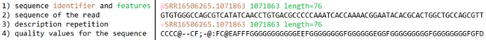

## DNA reader
The DNA reader is a program that obtains data from a sequencer (a machine used for tranforming genetic material into text) in a fastq format (.txt for better github compatibility).
Data example:

The evaluation of GC content can be usefull in:
* Bacterial classification during the separation of a high-level bacterial group.
* Laboratory experiments if you work with the so-called wet DNA to properly plan your experiment.
* Genome assembly when you intend to assemble a genome "puzzle" with the highest quality.

## Example
> python .\Small_projects\dna_reader\dna_reader.py
