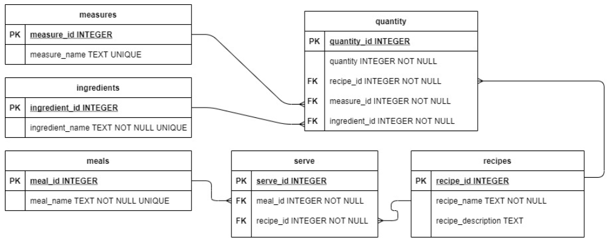

## Food Blog Backend
A basic backend project, thats includes a simple database query interface. With its help you can create a food blog, that contains recipes (measures, ingredients, meals, serve, quantities).

Below is a diagram of the database tables:

## Example
> python .\Small_projects\food_blog_backend\food_blog.py food_blog.db